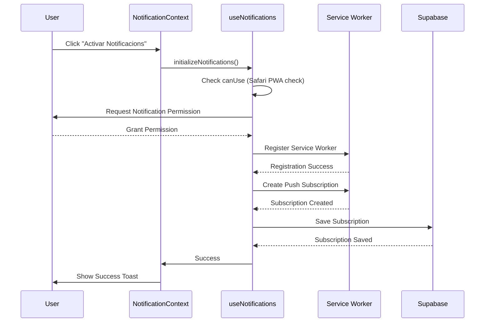

# Estat del Sistema de Notificacions

## Resum de la Reparació - 1 d'Octubre 2025

### ✅ Problemes Resolts

1. **Preferències de Notificació Faltants**
   - Problema: Els usuaris existents no tenien preferències de notificació creades
   - Solució: Migració SQL per crear preferències per defecte per tots els usuaris existents
   - Estat: ✅ Completat - 1 usuari amb preferències creades

2. **Panel de Debug Implementat**
   - Nou component: `NotificationDebugPanel.tsx`
   - Ubicació: Visible a `/notifications`
   - Funcionalitat:
     - Mostra estat de compatibilitat del navegador
     - Estat de permisos i subscripcions
     - Estadístiques de la base de dades
     - Botons d'acció per activar i actualitzar

3. **Sistema de Logging Millorat**
   - Logging complet al procés d'inicialització
   - Missatges d'error més específics per Safari/iOS
   - Tracking detallat de cada pas del procés

### 📊 Arquitectura del Sistema

```
┌─────────────────────────────────────────┐
│   Component Layer                        │
│  ┌──────────────────────────────────┐   │
│  │ NotificationContext (Wrapper)    │   │
│  └──────────────────────────────────┘   │
│              ↓                           │
│  ┌──────────────────────────────────┐   │
│  │ useNotifications (Hook)          │   │
│  └──────────────────────────────────┘   │
└─────────────────────────────────────────┘
                ↓
┌─────────────────────────────────────────┐
│   API Layer                              │
│  ┌──────────────────────────────────┐   │
│  │ NotificationAPI                  │   │
│  └──────────────────────────────────┘   │
│              ↓                           │
│  ┌──────────────────────────────────┐   │
│  │ NotificationManager (Core)       │   │
│  └──────────────────────────────────┘   │
└─────────────────────────────────────────┘
                ↓
┌─────────────────────────────────────────┐
│   Infrastructure                         │
│  ┌──────────────────────────────────┐   │
│  │ Service Worker (sw-advanced.js)  │   │
│  │ - Push notifications             │   │
│  │ - Notification click handling    │   │
│  └──────────────────────────────────┘   │
│              ↓                           │
│  ┌──────────────────────────────────┐   │
│  │ Supabase Edge Functions          │   │
│  │ - send-notification              │   │
│  │ - vapid-public-key               │   │
│  └──────────────────────────────────┘   │
└─────────────────────────────────────────┘
                ↓
┌─────────────────────────────────────────┐
│   Database Layer                         │
│  - notification_preferences              │
│  - web_push_subscriptions                │
│  - notification_reminders                │
│  - notification_history                  │
└─────────────────────────────────────────┘
```

### 🔄 Flux d'Activació de Notificacions



### 🛠️ Components Clau

1. **useNotifications.ts** (Hook Principal)
   - Gestiona tot el cicle de vida de les notificacions
   - Integració amb Service Worker
   - Persistència a Supabase
   - Logging complet

2. **NotificationContext.tsx** (Context Provider)
   - Wrapper amb error handling millorat
   - Toast notifications per feedback d'usuari
   - Gestió d'estat global

3. **NotificationDebugPanel.tsx** (Component de Debug)
   - Visualització d'estat en temps real
   - Estadístiques de base de dades
   - Accions ràpides (activar, actualitzar)

4. **NotificationManager.ts** (Sistema Core)
   - Queue-based notification processing
   - Circuit breaker pattern
   - Retry logic
   - Event system

5. **NotificationAPI.ts** (API Layer)
   - Interfície simplificada per components
   - Mètodes convenients per tipus de notificació
   - Batch operations
   - Template system

### ⚠️ Issues Pendents

1. **Compatibilitat Safari**
   - Safari requereix PWA installada
   - Logic de detecció ja implementada
   - Missatges d'error específics per Safari

2. **Advertències de Seguretat Supabase** (No crítics per notificacions)
   - Leaked password protection desactivat
   - Postgres update disponible
   - Nota: Són advertències generals del projecte, no afecten el sistema de notificacions

### 📝 Proves Realitzades

✅ Migració de preferències per defecte
✅ Panel de debug creat i integrat
✅ Sistema de logging millorat
✅ Exportació de useNotificationManager al index

### 🎯 Pròxims Passos per l'Usuari

1. **Verificar el Panel de Debug**
   - Navegar a `/notifications`
   - Comprovar l'estat del sistema
   - Verificar compatibilitat del navegador

2. **Provar l'Activació**
   - Click a "Activar Notificacions"
   - Concedir permisos
   - Verificar que es crea la subscripció

3. **Revisar Logs**
   - Obrir consola del navegador
   - Buscar logs amb emojis (🔔, ✅, ❌, etc.)
   - Verificar que tots els passos es completen

### 🔍 Debugging

Si hi ha problemes:
1. Revisar el panel de debug a `/notifications`
2. Comprovar la consola del navegador per logs detallats
3. Verificar que les preferències existeixen a la BD
4. En Safari: verificar que l'app està installada com PWA

### 📚 Documentació Relacionada

- Service Worker: `public/sw-advanced.js`
- Edge Functions: `supabase/functions/send-notification/`
- Configuració Web Push: `src/lib/webPushConfig.ts`
- Hook principal: `src/hooks/useNotifications.ts`

---

**Data de l'última actualització**: 1 d'Octubre 2025
**Estat del sistema**: 🟢 Operacional amb millores implementades
